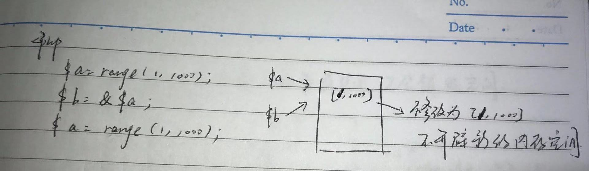

## 引用变量


>### 概念和定义方式
* 概念：在 PHP 中引用意味着用不同的名字访问同一个变量的内容
* 定义方式：使用 & 符号

>### 工作原理
*   ```php
        <?php
        // 定义一个变量
        $a = range(0, 1000);
        // 定义变量 b，将 a 的值给 b
        $b = $a;
        // 对于 PHP COW 机制：copy on write
        // 对于 $a 和 $b 其中的任何一个变量，只有对他们进行修改的时候，才会 copy 内存空间 
    ```
    
    <div align="center">
        
    </div>
    
    ```php
        // 对 a 进行修改
        $a = range(0, 1000);
        // 此时 $a 虽然值未改变，但已被重新定义
    ```
    
    <div align="center">
        
    </div>

*   ```php
        <?php
        $a = 1;
        var_dump(memory_get_usage());
        $b = $a;
        var_dump(memory_get_usage());
        // 上面两内存占用基本相等
        $a = 1;
        var_dump(memory_get_usage());
        // 内存有突然增加
    ```
    
*   ```php
        <?php
        $a = range(1, 1000);
        $b = &$a;
        $a = range(1, 1000);
    ```
    
    <div align="center">
        
    </div>